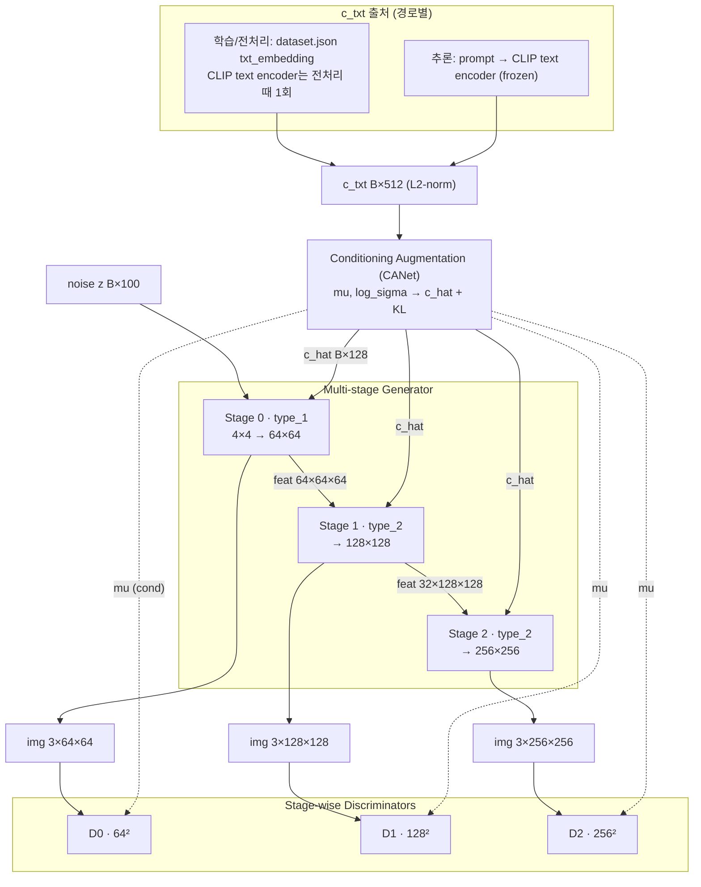
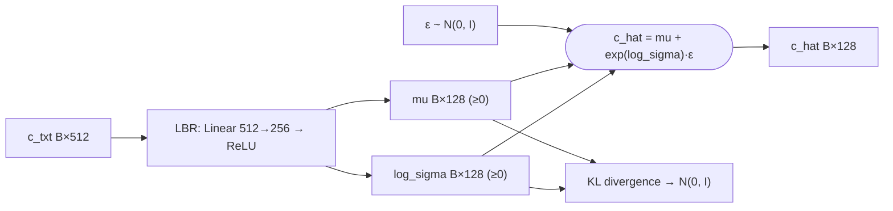
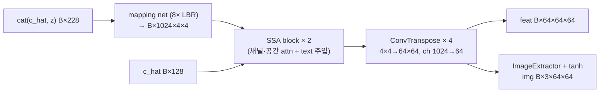
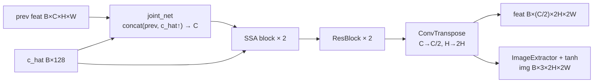
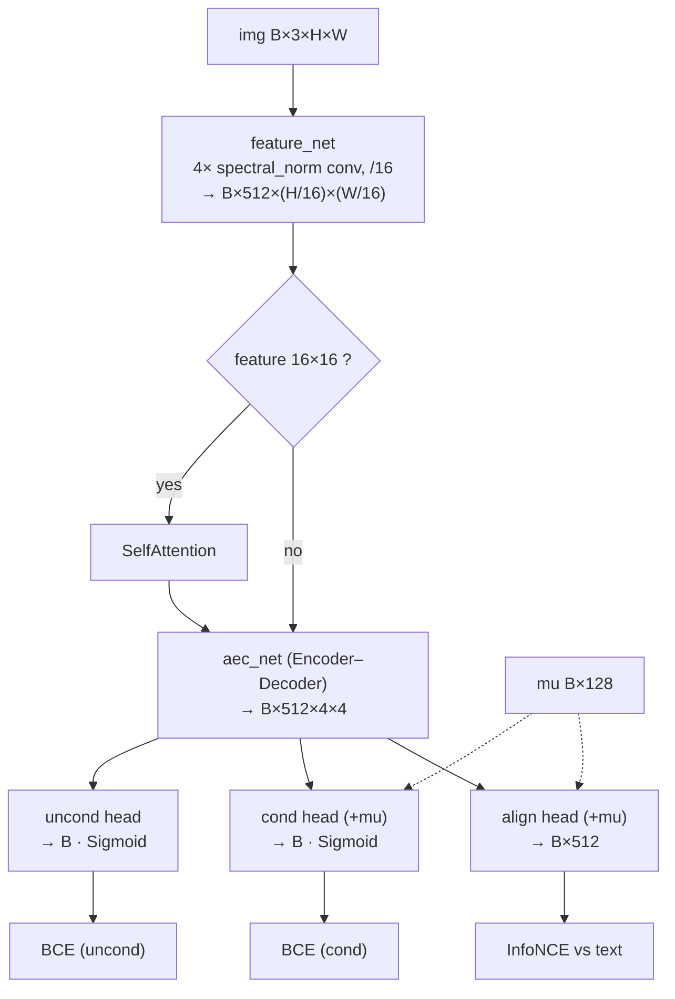
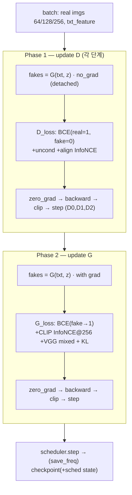

# 아키텍처 — 다단계 CLIP 가이드 생성

> **범위:** 다단계 생성기/판별기 구조, 텐서 흐름, CLIP 조건 증강, 손실 설계의 근거 + 논문용 다이어그램. 알려진 한계는 [explanation/correctness-and-fixes.md](correctness-and-fixes.md).
> **대상:** 개발자·논문 figure 작성자.
> **상태:** 구현 반영 — 기준일 2026-06-16.

> 그림은 Mermaid 소스로 둔다(Obsidian/GitHub 렌더, 텍스트라 검증·갱신 가능). 표기: `B`=배치, 텐서는 `채널×H×W`.

## 1. 전체 아키텍처 (Figure 1)

CLIP 텍스트 임베딩(`c_txt`, 512)을 조건 증강(CANet)으로 `c_hat`(128)로 변환하고, 노이즈 z(100)와 결합해 64→128→256을 단계적으로 생성한다. 단계마다 별도 판별기가 cond/uncond/정렬 점수를 낸다(StackGAN++ 계열).

**`c_txt`의 출처는 경로마다 다르다**: 학습은 전처리 때 **한 번** 계산해 `dataset.json`에 저장한 `txt_embedding`을 데이터로더가 로드한다(매 batch마다 CLIP 텍스트 인코더를 돌리지 않음). 추론은 프롬프트를 그 자리에서 CLIP 텍스트 인코더로 인코딩한다. 둘 다 L2 정규화 후 CANet에 들어간다.

> 학습 시 CLIP **이미지** 인코더(동결)는 stage 2(256)에서 대조 가이드(`contrastive_loss_G`)로만 쓰인다([§5 손실](#5-손실)). 학습 조건 `c_txt`는 전처리된 텍스트 임베딩이다.

## 2. 조건 증강 — CANet (Figure 2)

[networks/generator.py](../../networks/generator.py) `ConditioningAugmention`: `c_txt`(512)를 `LBR`(Linear bias=False → ReLU, norm 없음)로 256차원에 사상한 뒤 앞/뒤 128씩 `(mu, log_sigma)`로 분리하고, reparameterization으로 `c_hat = mu + exp(log_sigma)·ε`를 샘플한다. ReLU가 split **앞**에 있어 `mu`·`log_sigma ≥ 0`이다(StackGAN CA_NET과 동일 — 순수 affine이 아님). KL 정규화([criteria/loss.py](../../criteria/loss.py) `KL_divergence`)가 잠재 분포를 N(0,1) 부근으로 유지한다.

## 3. 생성기 (단계별)

[networks/generator.py](../../networks/generator.py) `Generator`가 `num_stage`개 서브 생성기를 `ModuleList`로 보유하고, 각 단계의 특징맵을 다음 단계로 전달한다.

| 단계 | 클래스 | 입력 | 출력 특징맵 | 출력 이미지 |
|---|---|---|---|---|
| 0 | `Generator_type_1` | `cat(c_hat·128, z·100)`=228 | B×64×64×64 | B×3×64×64 |
| 1 | `Generator_type_2` | prev B×64×64×64 + c_hat | B×32×128×128 | B×3×128×128 |
| 2 | `Generator_type_2` | prev B×32×128×128 + c_hat | B×16×256×256 | B×3×256×256 |

단계 간 채널 계약: `prev_chans = in_chans // (2**4 << (i-1))`가 직전 단계 출력 채널과 정확히 일치(64→32). SSA의 텍스트 차원은 `cond_dim`을 명시적으로 받는다(노이즈 차원 가정 없음).

### 3.1 Stage 0 — `Generator_type_1` (Figure 3a)

### 3.2 Stage i≥1 — `Generator_type_2` (Figure 3b)

SSA(Semantic-Spatial Aware) 블록은 채널·공간 어텐션 후 텍스트 임베딩을 더한다([networks/block.py](../../networks/block.py) `SemanticSpatialAwareBlock`, SSAGAN/EIGGAN 계열).

## 4. 판별기 (단계별, Figure 4)

[networks/discriminator.py](../../networks/discriminator.py) `Discriminator`는 단계(`curr_stage`)마다 입력 해상도가 달라도 모두 `B×512×4×4`(=8·Nd)로 축약한 뒤 3개 헤드로 분기한다.

- 진위 출력은 `Sigmoid` 확률 → BCE. 정렬 출력은 `flatten(1)`로 `B×512`(배치=1에서도 안전).
- Lipschitz 제약은 `feature_net`의 spectral_norm으로 제공(WGAN-GP 미사용, [§2 적용된 핵심 수정](correctness-and-fixes.md#2-적용된-핵심-수정) 참조).

## 5. 손실

[criteria/loss.py](../../criteria/loss.py).

| 손실 | 적용 | 설명 |
|---|---|---|
| 적대(cond) | D·G | `Sigmoid`+BCE, real=1/fake=0, G는 non-saturating |
| 적대(uncond) | `--use_uncond_loss` | 조건 없는 진위 판별 |
| 대조(D 정렬) | `--use_contrastive_loss` | `align_out`·`txt` L2 정규화 후 InfoNCE(`contrastive_loss_D`) |
| 대조(G·CLIP) | `--use_contrastive_loss`, **stage 2(≥256)** | 생성 이미지를 동결 CLIP에 통과시켜 텍스트와 InfoNCE(`contrastive_loss_G`, float32) |
| 혼합(perceptual) | `--use_mixed_loss` | L1 + VGG16 perceptual(`mixed_loss`, VGG 캐시·[0,1] denorm 입력) |
| KL(CANet) | 항상 | 조건 증강 정규화(`KL_divergence`) |

CLIP(ViT-B/32)은 동결되어 생성기 가이드 신호로만 쓰인다([scripts/train.py](../../scripts/train.py)에서 `requires_grad_(False)`).

## 6. 학습 루프 — 2단계 업데이트 (Figure 5)

[scripts/trainer.py](../../scripts/trainer.py) `train_step()`. D와 G가 **같은 조건(`txt_feature`)** 을 쓰는 것이 핵심(학습/추론 일치).

1. **D 업데이트**: `txt_feature`로 `torch.no_grad()`에서 fake 생성(생성기 그래프 분리) → 단계별 D 손실 backward·step.
2. **G 업데이트**: 동일 `txt_feature`로 grad 포함 fake 재생성 → 단계별 G 손실 + KL backward·step.
3. epoch 종료 시 스케줄러 step → `save_freq` 주기로 체크포인트 저장(스케줄러 상태 포함).

## 관련 문서

- [explanation/correctness-and-fixes.md](correctness-and-fixes.md) — 수정 이력·남은 한계
- [reference/dataset-format.md](../reference/dataset-format.md) — 조건 임베딩 출처
