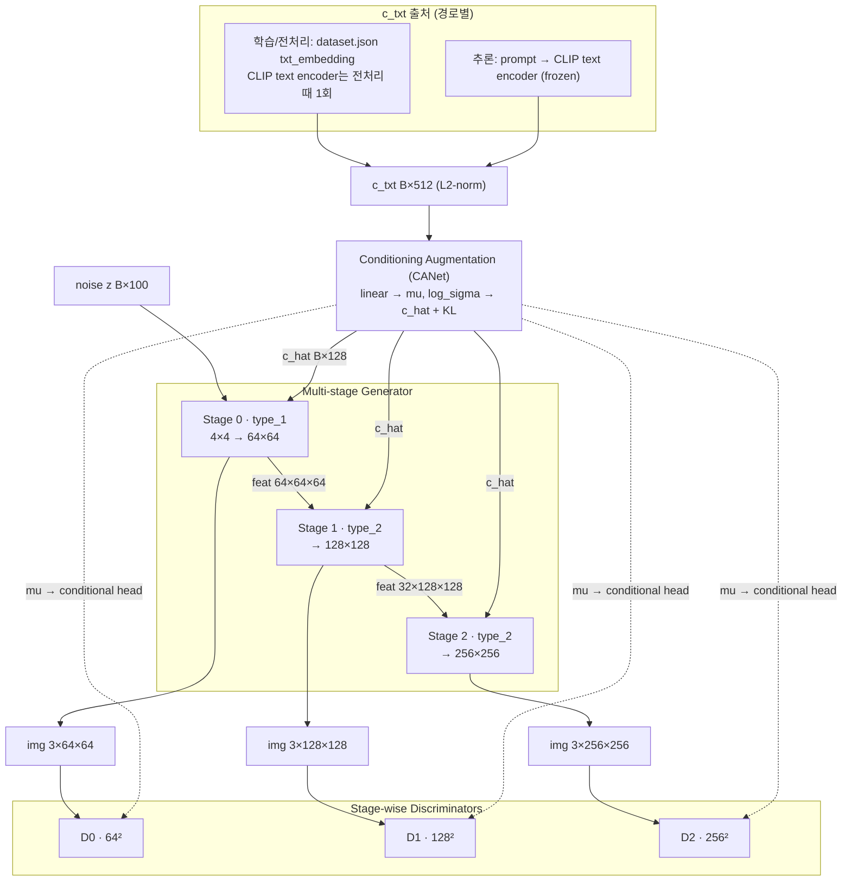
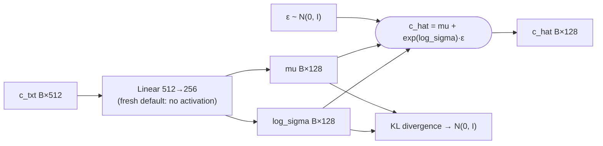
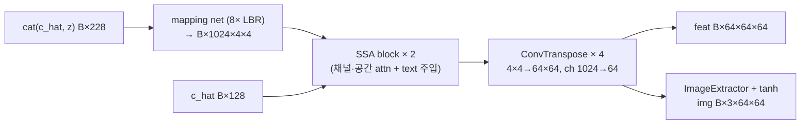
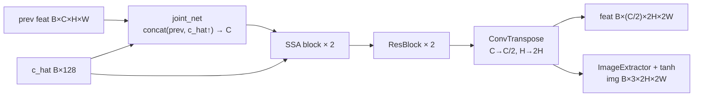
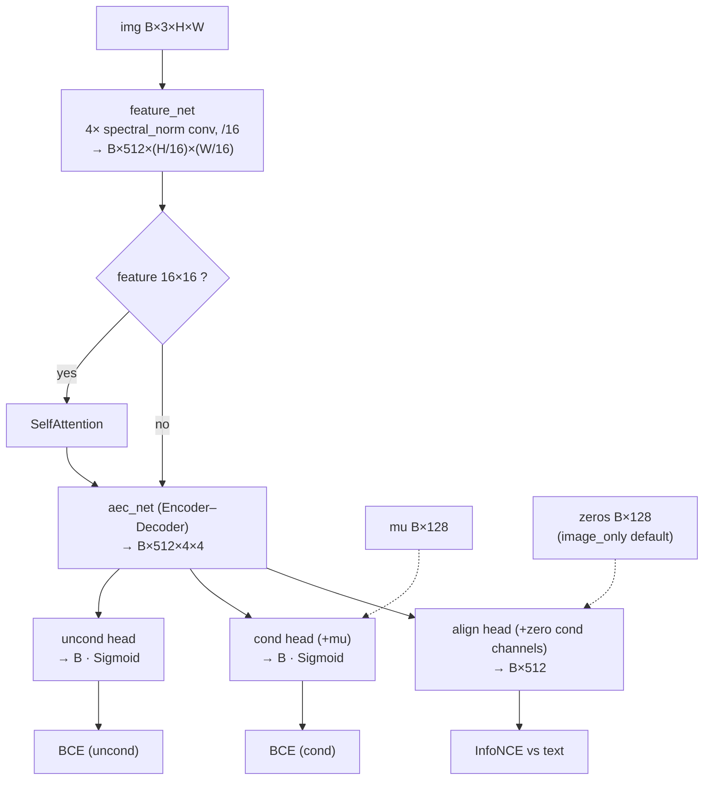
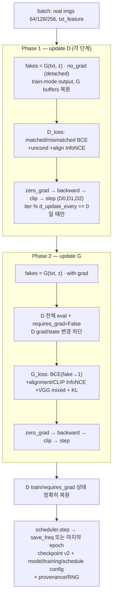

# 아키텍처 — 다단계 CLIP 가이드 생성

> **범위:** 다단계 생성기/판별기 구조, 텐서 흐름, CLIP 조건 증강, 손실 설계의 근거 + 논문용 다이어그램. 알려진 한계는 [explanation/correctness-and-fixes.md](correctness-and-fixes.md).
> **대상:** 개발자·논문 figure 작성자.
> **상태:** 구현 반영 — 기준일 2026-07-23.

> 그림은 Mermaid 소스로 둔다(Obsidian/GitHub 렌더, 텍스트라 검증·갱신 가능). 표기: `B`=배치, 텐서는 `채널×H×W`.

## 1. 전체 아키텍처 (Figure 1)

CLIP 텍스트 임베딩(`c_txt`, 512)을 조건 증강(CANet)으로 `c_hat`(128)로 변환하고, 노이즈 z(100)와 결합해 64→128→256을 단계적으로 생성한다. 단계마다 별도 판별기가 conditional/unconditional 진위와 image-text 정렬 출력을 낸다(StackGAN++ 계열).

**`c_txt`의 출처는 경로마다 다르다**: 학습은 전처리 때 **한 번** 계산해 `dataset.json`에 저장한 `txt_embedding`을 데이터로더가 로드한다(매 batch마다 CLIP 텍스트 인코더를 돌리지 않음). 추론은 프롬프트를 그 자리에서 CLIP 텍스트 인코더로 인코딩한다. 둘 다 L2 정규화 후 CANet에 들어간다.

> 학습 시 CLIP **이미지** 인코더(동결)는 출력 변이 256 이상인 stage에 대조 가이드(`contrastive_loss_G`)로 쓰인다. 기본 3-stage에서는 stage 2(256) 하나다([§5 손실](#5-손실)). 학습 조건 `c_txt`는 전처리된 텍스트 임베딩이다. 새 기본 `image_only` alignment head는 `mu`를 보지 않고 image feature만 text embedding과 대조한다.

## 2. 조건 증강 — CANet (Figure 2)

[networks/generator.py](../../networks/generator.py) `ConditioningAugmention`은 `c_txt`(512)를 bias 없는 Linear로 256차원에 사상하고 앞/뒤 128씩 `(mu, log_sigma)`로 분리한다. 새 학습 기본 `--conditioning_activation linear`는 split 전 활성화를 두지 않아 둘 다 양수·음수를 표현한다. `c_hat = mu + exp(log_sigma)·ε`로 샘플하고 KL 정규화([criteria/loss.py](../../criteria/loss.py) `KL_divergence`)가 분포를 `N(0,I)` 부근으로 민다.

`--deterministic_cond`(기본 off)를 켜면 이 reparameterization을 건너뛰고 `c_hat = mu`를 그대로 쓴다. KL이 `sigma`를 1.0 부근에 고정하는 상태에서는 unit-variance `ε` 항이 caption-종속 신호(차원당 표준편차 0.001~0.005)를 압도해 conditioning이 사실상 죽는데, `--deterministic_cond`는 그 노이즈 자체를 없애 대응한다(측정된 근본 원인은 [explanation/correctness-and-fixes.md §2.4](correctness-and-fixes.md#24-2026-07-23-conditioning-붕괴-진단복구)).

metadata가 없는 기존 checkpoint는 호환을 위해 `--conditioning_activation relu`, `--deterministic_cond=False`(기존 확률적 forward) 의미로 로드된다. 이 legacy 모드는 split 전에 ReLU를 적용해 `mu, log_sigma ≥ 0`이므로, 새 기본값의 효과를 얻으려면 재학습해야 한다([§3 Checkpoint 호환·재학습 계약](correctness-and-fixes.md#3-checkpoint-호환재학습-계약)).

## 3. 생성기 (단계별)

[networks/generator.py](../../networks/generator.py) `Generator`가 `num_stage`개 서브 생성기를 `ModuleList`로 보유하고, 각 단계의 특징맵을 다음 단계로 전달한다.

| 단계 | 클래스 | 입력 | 출력 특징맵 | 출력 이미지 |
|---|---|---|---|---|
| 0 | `Generator_type_1` | `cat(c_hat·128, z·100)`=228 | B×64×64×64 | B×3×64×64 |
| 1 | `Generator_type_2` | prev B×64×64×64 + c_hat | B×32×128×128 | B×3×128×128 |
| 2 | `Generator_type_2` | prev B×32×128×128 + c_hat | B×16×256×256 | B×3×256×256 |

단계 간 채널 계약: `prev_chans = in_chans // (2**4 << (i-1))`가 직전 단계 출력 채널과 정확히 일치(64→32). SSA의 텍스트 차원은 `cond_dim`을 명시적으로 받는다(노이즈 차원 가정 없음).

### 3.1 Stage 0 — `Generator_type_1` (Figure 3a)

### 3.2 Stage i≥1 — `Generator_type_2` (Figure 3b)

SSA(Semantic-Spatial Aware) 블록은 채널·공간 어텐션 후 텍스트 임베딩을 더한다([networks/block.py](../../networks/block.py) `SemanticSpatialAwareBlock`, SSAGAN/EIGGAN 계열).

## 4. 판별기 (단계별, Figure 4)

[networks/discriminator.py](../../networks/discriminator.py) `Discriminator`는 단계(`curr_stage`)마다 입력 해상도가 달라도 모두 `B×512×4×4`(=8·Nd)로 축약한 뒤 3개 헤드로 분기한다.

- 진위 출력은 `Sigmoid` 확률 → BCE. conditional head는 `mu`를 받는다. alignment head는 새 기본 `--alignment_mode image_only`에서 parameter shape 호환을 위해 128 condition channel을 유지하되 0으로 채운다. `--alignment_mode legacy_conditioned`만 `mu`를 넣는다.
- 정렬 출력은 `flatten(1)`로 `B×512`다. InfoNCE를 켠 학습은 의미 없는 batch 1을 parse 단계에서 거부하고 마지막 singleton remainder만 drop한다.
- 한 image view의 shared feature trunk는 한 번만 실행한다. detailed forward가 그 feature를
  matched/mismatched conditional, unconditional, alignment head에 재사용하므로 wrong-text나
  uncond 항을 켜도 feature-extractor BatchNorm/spectral-normalization state를 추가 갱신하지 않는다.
- Lipschitz 제약은 `feature_net`의 spectral_norm으로 제공(WGAN-GP 미사용, [§2 적용된 수정](correctness-and-fixes.md#2-적용된-수정) 참조).

## 5. 손실

[criteria/loss.py](../../criteria/loss.py).

| 손실 | 단계·가중치 | 설명 |
|---|---|---|
| D conditional BCE | 각 단계, D 전체 합에 `0.5` | matched real→`real_label_smooth`. batch>1 기본은 generated fake와 real/mismatched가 기존 negative mass를 절반씩 공유(`real + 0.5×(fake+wrong)`); 해제/B=1은 기존 `real+fake` |
| D unconditional BCE | `--use_uncond_loss`, 각 단계, D phase scale `0.5` | real→`real_label_smooth`, fake→0 |
| D image-text InfoNCE | `--use_contrastive_loss`, real/fake 각각 `--gamma`(기본 5.0), D phase 적용 후 `×0.5` | `align_out`·`txt` L2 정규화 후 diagonal cross-entropy(`contrastive_loss_D`). `--cond_warmup_epochs`/`--cond_ramp_epochs`로 이 두 항(D image trunk를 공유)을 초기 epoch 동안 게이트/ramp 가능 |
| G conditional BCE | 각 단계, `1.0` | fake→1 non-saturating objective |
| G unconditional BCE | `--use_uncond_loss`, 각 단계, `0.5` | fake→1 |
| G alignment InfoNCE | `--use_contrastive_loss`, 각 단계, `--gamma×0.5`(기본 2.5) | D의 image-only `align_out`을 text와 정렬 |
| G CLIP InfoNCE | `--use_contrastive_loss`, 출력 변 256(`CLIPConfig.MIN_QUALITY_SIZE`) 이상(`--lam`, 기본 10.0) | raw fake를 동결 CLIP image encoder에 통과시켜 text와 정렬; 기본 3-stage에서는 256 stage만, similarity는 float32 |
| G mixed | `--use_mixed_loss`, 각 단계, 총 `0.1` | raw fake/real의 `0.3×L1 + 0.7×VGG16 perceptual`; VGG 입력은 `[0,1]`, network는 device별 cache |
| KL(CANet) | batch당 1회, `--kl_weight`(기본 1.0) | 모든 단계 G loss 합에 조건 증강 KL을 한 번 더함. `--kl_weight 0`은 KL 항을 완전히 제거([explanation/correctness-and-fixes.md §2.4](correctness-and-fixes.md#24-2026-07-23-conditioning-붕괴-진단복구)) |

`--gamma`/`--lam`/`--kl_weight`/`--cond_warmup_epochs`/`--cond_ramp_epochs`는 이전에
literal로 하드코딩됐던 값을 노출한 것이며, 각 기본값은 그 literal을 그대로 재현한다
([reference/configuration.md §2 학습 옵션](../reference/configuration.md#2-학습-옵션-trainoptions)).

CLIP(ViT-B/32)은 동결되어 생성기 가이드 신호로만 쓰인다([scripts/train.py](../../scripts/train.py)에서 `requires_grad_(False)`). DiffAugment를 켜면 D update에서는 real/fake 양쪽 D 입력에 적용하고, G update에서는 fake의 **D가 보는 view**에만 적용한다. CLIP/VGG 항은 증강하지 않은 raw fake를 쓴다.

## 6. 학습 루프 — 2단계 업데이트 (Figure 5)

[scripts/trainer.py](../../scripts/trainer.py) `train_step()`. D와 G가 **같은 조건(`txt_feature`)** 을 쓰는 것이 핵심(학습/추론 일치).

1. **D 업데이트**: `iter % d_update_every == 0`일 때만 별도 noise로 fake를 `torch.no_grad()` 생성한다. train-mode batch-stat 출력은 쓰되 forward 전후 G buffer를 복원해 BatchNorm state를 D-only 단계에서 갱신하지 않는다. 이후 단계별 D 손실 backward·step하며 skip된 iteration은 D 평균 분모에 넣지 않는다.
2. **G 업데이트**: D gradient를 비운 뒤 새 noise로 fake를 grad 포함 재생성한다. 모든 D를 잠시 eval/freeze한 범위에서 단계별 G 손실 합 + KL을 backward하고 G만 step한다. D를 통한 image gradient만 G로 흐르고 D parameter/buffer는 바뀌지 않는다.
3. **상태 복원·저장**: 각 D의 원래 train/`requires_grad` 상태를 복원한다. epoch 종료 시 scheduler step 후 `save_freq` 주기 **또는 마지막 epoch**에 checkpoint v2(model/training/schedule config·학습 provenance·RNG·optimizer/scheduler 포함)를 저장한다.

## 관련 문서

- [explanation/correctness-and-fixes.md](correctness-and-fixes.md) — 수정 이력·남은 한계
- [reference/dataset-format.md](../reference/dataset-format.md) — 조건 임베딩 출처
