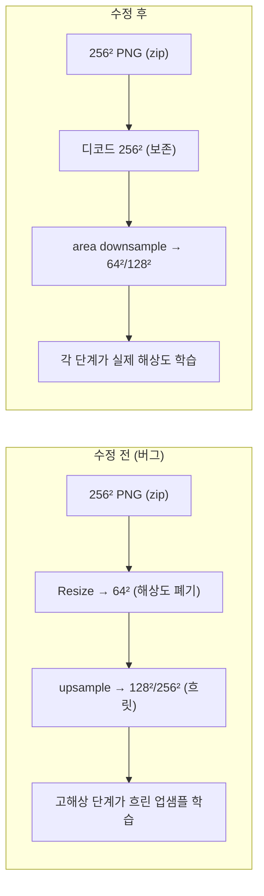

# 정확성 감사 · 수정 · 남은 주의점

> **범위:** 코드 정확성 감사로 고친 핵심 버그, 그 근거, 그리고 결과/수치를 인용하기 전 알아야 할 한계. ⭐ 학습·평가 수치를 보고하기 전 필독.
> **대상:** 개발자·실험 결과를 인용하는 사람.
> **상태:** 구현 반영(수정 적용 완료) — 기준일 2026-06-16. ⚠️ 런타임 스모크 테스트는 미실행([§4 남은 주의점과 미검증](#4-남은-주의점과-미검증)).

## 1. 배경

3라운드 정밀 검토로 학습·데이터·추론·평가 파이프라인의 정확성 문제를 식별하고 수정했다. 아키텍처(다단계 G/D, [explanation/architecture.md](architecture.md))는 차원적으로 자기일관적이었고, 문제는 주로 데이터 처리·조건화·체크포인트·평가에 있었다.

## 2. 적용된 핵심 수정

### 2.1 Critical (결과 타당성/실행)

| 영역 | 증상(수정 전) | 수정 | 위치 |
|---|---|---|---|
| 데이터 해상도 | 모든 이미지를 64로 다운샘플 후 128/256으로 업샘플 → 고해상 단계가 흐린 업샘플본을 학습 | 256 보존 로딩 + 각 단계로 다운샘플(지연 디코딩) | [dataset/dataloader.py](../../dataset/dataloader.py) `MM_CelebA` |
| 학습 조건 일치 | D는 교란된 이미지 임베딩, G는 텍스트 임베딩으로 학습(비대칭·비문서화) | D·G 모두 `txt_feature` 사용, 교란 블록 제거, D용 fake는 `no_grad`로 분리 | [scripts/trainer.py](../../scripts/trainer.py) `train_step()` |
| 다중 GPU 체크포인트 | `DataParallel` `module.` 접두사로 추론 로드 실패 | 저장 시 unwrap, 로드 시 접두사 자동 제거, 추론은 D ckpt 불필요 | [utils/utils.py](../../utils/utils.py) |
| 추론 저장 경로 | `Path + str` 결합으로 잘못된 경로 | `os.path.join` + `G.eval()` + num_stage 일반화 | [scripts/infer.py](../../scripts/infer.py) |
| 평가 무효 | 배치별 FID 평균(무의미) + `normalize=True`에 uint8 투입 | 단일 FID/IS에 전 배치 누적 후 1회 compute, `normalize=False`+uint8 | [scripts/eval.py](../../scripts/eval.py), [criteria/metric.py](../../criteria/metric.py) |
| 셸 스크립트 | 하드코딩 절대 경로 + 깨진 기본 resume | 상대 경로화, resume 기본 비활성 | [train.sh](../../train.sh)·[infer.sh](../../infer.sh)·[eval.sh](../../eval.sh) |

**데이터 해상도 수정 전/후 (Figure)** — 가장 영향이 큰 수정. 멀티스테이지 초해상이 흐린 업샘플 재현으로 무력화되던 문제를 해소.

### 2.2 Major (정합성/안정성)

- **WGAN-GP 제거**: `Sigmoid`+BCE와 모순되는 gradient penalty를 제거하고 spectral_norm으로 Lipschitz 제약 일원화([criteria/loss.py](../../criteria/loss.py)).
- **대조 손실 정합**: `contrastive_loss_D`를 L2 정규화 + cross-entropy(InfoNCE)로 통일(기존 비정규화 KL-with-one-hot 대체).
- **CLIP 동결 + fp32 대조**: CLIP `requires_grad_(False)`, G측 CLIP 대조는 float32로 계산해 fp16 불안정 회피.
- **VGG perceptual 캐시**: 매 iteration 재생성하던 VGG16을 디바이스별 캐시 + [0,1] denormalize 입력.
- **판별기 정렬 출력**: `x.squeeze()`→`x.flatten(1)`(배치=1 붕괴 방지).
- **생성기 차원**: SSA `cond_dim`을 명시 전달(`noise_dim=100` 하드코딩 제거).
- **스케줄러 상태**: 체크포인트에 LR 스케줄러 상태 저장·복구, `scheduler.step()`을 저장 **이전**으로 이동(resume 시 LR 연속).
- **GPU 처리**: `--gpu_ids`를 실제 디바이스 인덱스로 사용(죽은 재매핑 분기 제거).
- **옵션 파싱**: `parse_known_args`→`parse_args`(오타 옵션 무시 방지).
- **전처리 견고성**: 이미지 로드 실패 시 `continue`, 빈 캡션 샘플 skip, zip 경로 prefix 가정 완화, 단일 zip 입력 명확한 에러.
- **체크포인트 로드**: `weights_only=True` 우선 + 폴백, 경로 이중 중첩 제거.
- **위생**: `.gitignore` 추가(캐시·산출물·데이터), `environment.yml`의 conda `torchmetrics[image]` 제거.

## 3. ⭐ 결과/수치 인용 주의

- **FID 표본 수**: 신뢰할 만한 FID는 수천 장 통계가 필요하다. `eval.py`는 단일 메트릭에 누적하므로 평균-오류는 제거됐지만, 평가 표본이 적으면 여전히 불안정하다. 보고 시 사용한 표본 수를 함께 밝힌다.
- **real 이미지 출처**: 데이터 해상도 수정 이후 FID의 real 분포는 전처리된 256 이미지(진짜 고해상)다. 수정 전 산출한 수치는 흐린 업샘플 기준이라 **비교 불가**.
- **CLIP score**: 생성 이미지를 동결 CLIP에 통과시켜 조건 텍스트와의 코사인을 측정한다(이미지 피처는 fp16 경로). 생성-조건 정렬 지표로는 합리적이나, 학습에 같은 CLIP을 쓰므로 절대값을 과대 해석하지 않는다.
- **방법론 위치**: 이 저장소는 StackGAN++/LAFITE/AttnGAN 아이디어의 조합("MS-CLIP-GAN")이다. 단계별 초해상·CLIP 가이드는 구현되어 있으나, 외부 벤치마크 대비 성능 주장은 별도 실험으로 뒷받침해야 한다.

## 4. 남은 주의점과 미검증

- 🟠 **런타임 스모크 테스트 미실행**: 감사 환경에 torch/clip 미설치로 실제 학습·추론 런은 확인하지 못했다(전체 파일 AST 파싱·정적 교차검증만 통과). 권장: 의존성 설치 후 **소규모 1-에폭 스모크런 + resume 1회**로 회귀 확인.
- 🟠 **대조-D 의미**: `contrastive_loss_D`는 real·fake 정렬 모두에 InfoNCE를 적용한다(기존 동작 유지). fake 정렬을 텍스트와 맞추도록 미는 것이 판별기 역할과 상충할 수 있다 — 설계 재검토 여지.
- 🟢 **보조 손실 토글**: uncond/contrastive/mixed는 기본 off. 켤 때 안정성은 데이터·배치에 따라 다르므로 BCE 베이스라인부터 점증 권장.

## 관련 문서

- [explanation/architecture.md](architecture.md) — 무엇을 고쳤는지의 구조적 맥락
- [how-to/troubleshooting.md](../how-to/troubleshooting.md) — 증상별 대응
