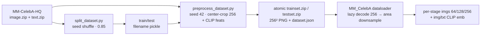

# Dataset 포맷 레퍼런스

> **범위:** 전처리 출력 zip 구조, `dataset.json` 임베딩 스키마, 데이터로더가 이를 읽는 계약. 준비 절차는 [how-to/prepare-dataset.md](../how-to/prepare-dataset.md).
> **대상:** 개발자.
> **상태:** 구현 반영 — 기준일 2026-07-10.

**전처리 → 학습 데이터 흐름 (Figure)**



## 1. 출력 zip 구조

[preprocess_dataset.py](../../preprocessing/preprocess_dataset.py) `convert_dataset()`가 생성한다.

```
trainset.zip
├── 00000/img00000000.png      # 256x256 uncompressed PNG
├── 00000/img00000001.png
├── ...
└── dataset.json               # CLIP 임베딩 메타데이터
```

- 이미지 키: `f'{idx:08d}'` → `"{앞5자리}/img{8자리}.png"`.
- 색상/범위: source mode와 무관하게 RGB 3-channel PNG(0–255)로 저장되고, 데이터로더가 텐서화하며 `[-1,1]`로 정규화한다.

## 2. `dataset.json` 스키마

```json
{
  "clip_img_features": [ ["00000/img00000000.png", [<512 floats>]], ... ],
  "clip_txt_features": [ ["00000/img00000000.png", [[<512 floats>], ...]], ... ],
  "preprocess": {
    "schema_version": 1,
    "seed": 42,
    "clip_model": "ViT-B/32",
    "clip_embedding_dim": 512,
    "transform": "center-crop",
    "resize_filter": "lanczos",
    "width": 256,
    "height": 256,
    "max_images": null,
    "image_feature_crop_ratio": 0.99
  }
}
```

| 키 | 형태 | 의미 |
|---|---|---|
| `clip_img_features` | `[fname, [512]]` 리스트 | 이미지당 CLIP `encode_image` 피처 1개 |
| `clip_txt_features` | `[fname, [[512], ...]]` 리스트 | 이미지당 비어 있지 않은 캡션 피처 N개(최대 10) |
| `preprocess` | object | seed, CLIP model/dimension, resize/crop 설정 |

정상 ZIP 생성은 모든 선택 stem이 정확히 한 image와 대응하고 모든 sample의 image/text
encoding이 성공해야 commit된다. duplicate/missing stem 또는 빈 caption을 포함해 한 건이라도
실패하면 staged ZIP을 폐기하고 기존 destination을 보존한다. ZIP entry metadata와 JSON
직렬화 순서는 고정된다. raw revision·split-list hash는 이 object에 없으므로 별도
`download_provenance.json`과 filename pickle을 함께 보존한다.

## 3. 데이터로더 계약 (`MM_CelebA`)

[dataset/dataloader.py](../../dataset/dataloader.py) `MM_CelebA`.

- **지연 로딩**: `_load_metadata()`는 파일 인덱스와 임베딩만 읽고, 이미지는 `__getitem__`에서 워커별 ZipFile 핸들로 디코딩(다중 워커 안전).
- **해상도 보존**: 이미지를 **최고 해상도(256)** 로 디코딩한 뒤 각 단계로 **다운샘플**(`F.interpolate(mode='area')`)해 `[64, 128, 256]` 리스트 반환. 64로 줄였다 키우지 않는다.
- **임베딩 처리**: `clip_img_features`는 L2 정규화. `clip_txt_features`는 2D면 `[N,512]`, 1D(단일 캡션)면 `[1,512]`로 보정. `__getitem__`에서 캡션 1개를 랜덤 선택.
- **유효 샘플만 인덱싱**: 이미지·텍스트 임베딩을 **둘 다** 가진 파일만 인덱스에 넣는다(없으면 드롭 + 경고). → 빈 캡션으로 인한 IndexError/KeyError 방지.
- **contrastive batch**: 학습에서 `--use_contrastive_loss`를 켜면 batch 1을 거부하고, dataset 길이의 나머지가 정확히 1일 때만 마지막 singleton batch를 drop한다. 평가 loader에는 이 규칙을 적용하지 않는다.

```python
# __getitem__ 반환
imgs, img_embedding, txt_embedding = dataset[i]
# imgs: list[Tensor]  = [ [3,64,64], [3,128,128], [3,256,256] ]  (값 범위 [-1,1])
# img_embedding: Tensor[512]   (정규화된 CLIP 이미지 피처)
# txt_embedding: Tensor[512]   (랜덤 선택된 정규화 CLIP 텍스트 피처)
```

| 상수 | 값 | 위치 |
|---|---|---|
| `BASE_SIZE` | 64 | `MM_CelebA.BASE_SIZE` |
| 단계 해상도 | `64 * 2**i` (i=0..num_stage-1) | `self.img_sizes` |

> 🟢 학습은 `txt_embedding`을 조건으로 쓴다(`img_embedding`은 현재 학습에서 사용하지 않음). 자세한 조건화 흐름은 [explanation/architecture.md](../explanation/architecture.md)·[explanation/correctness-and-fixes.md](../explanation/correctness-and-fixes.md).
>
> 🟢 학습 loader는 여러 caption 중 매 접근마다 1개를 랜덤 선택하지만, [experiments/eval_curve.py](../../experiments/eval_curve.py)는 재현 가능한 곡선을 위해 이미지마다 저장된 **첫 번째 caption 1개**를 사용한다. “모든 test caption 평가”가 아니다.

## 관련 문서

- [how-to/prepare-dataset.md](../how-to/prepare-dataset.md) — 전처리 절차
- [explanation/architecture.md](../explanation/architecture.md) — 임베딩이 조건으로 들어가는 경로
